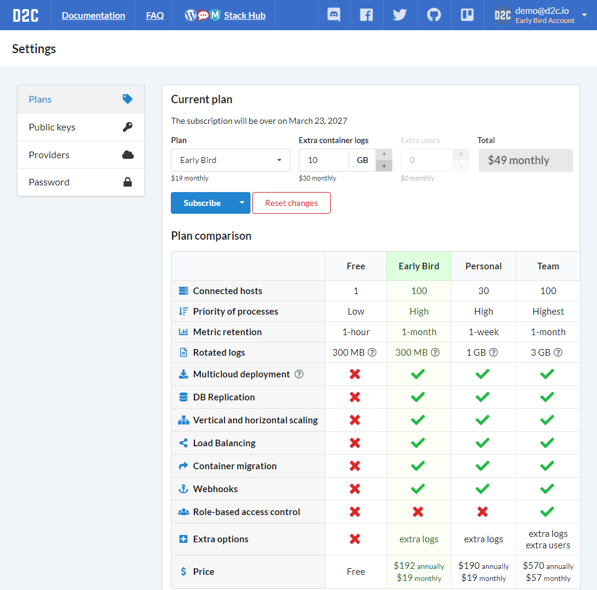
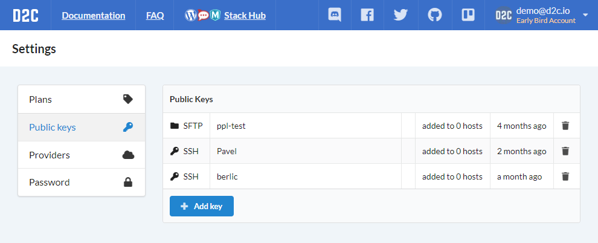
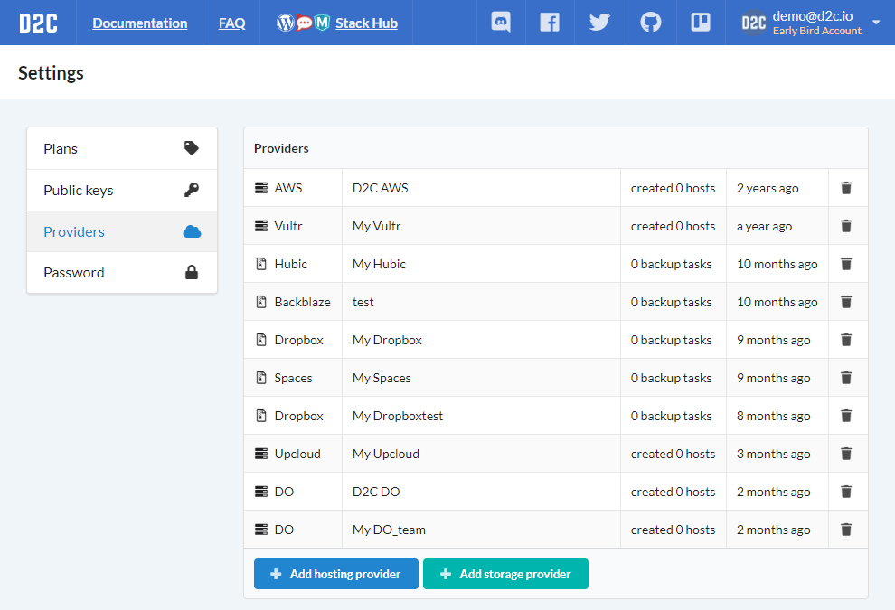
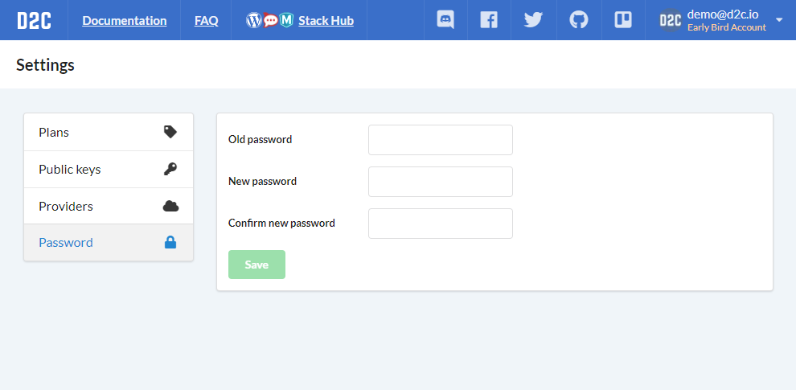

# Introduction

Для того, чтобы создать аккаунт в D2C перейдите по [ссылке](https://panel.d2c.io/account/signup). Вы можете использовать профили социальных сетей (Google, Facebook, GitHub, BitBucket) или логин и пароль.

В [настройках аккаунта](https://panel.d2c.io/settings) вы можете:

- обновить [тариф](/account/plan/)
- добавить или удалить [публичные ключи](/platform/ssh-sftp)
- добавить или удалить аккаунты [хостинг](/getting-started/cloud-providers) и [бэкап](/getting-started/storage-providers) провайдеров
- изменить пароль

### Скриншоты

