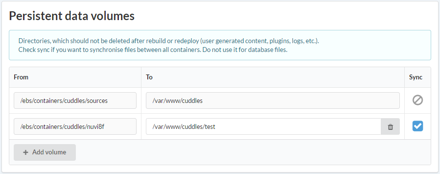
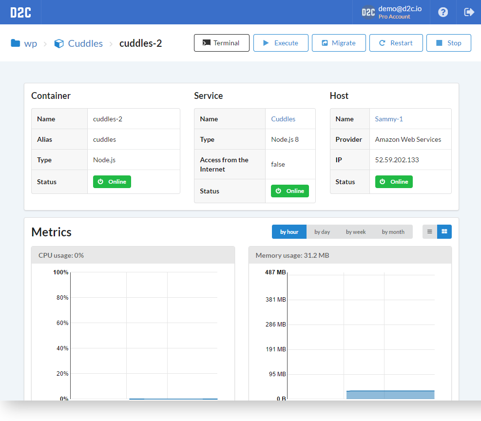
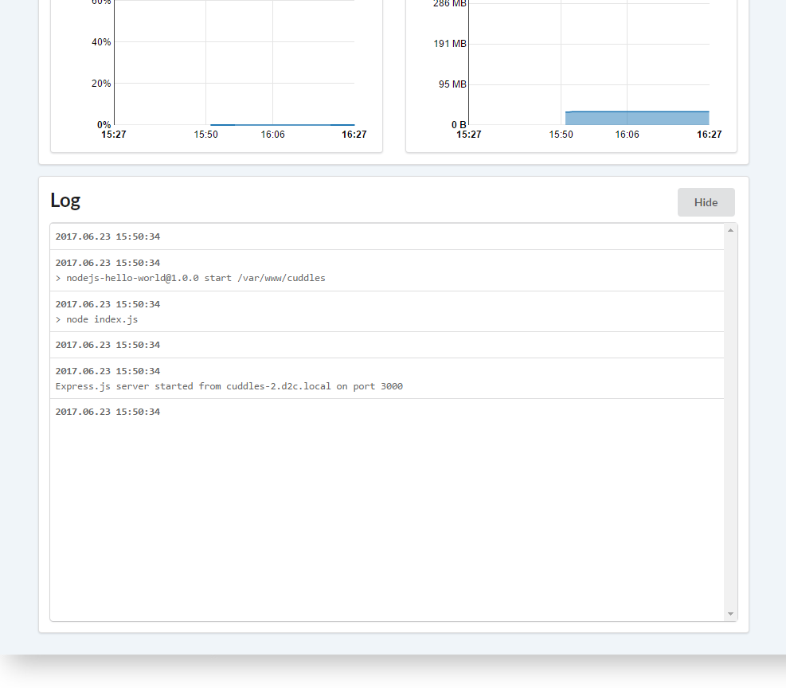

# Вступление

В Интернете достаточно много подробной информации о Docker контейнерах. Предлагаем ознакомиться со  [статьей](https://www.docker.com/what-container) с официального сайта Docker.

## Постоянное хранилище

Приложения внутри контейнеров должны быть легковесными, доступными и легко заменимыми. По этой причине D2C разделяет приложение от данных приложения. Docker volumes используются для хранения постоянных данных. Данные хранятся локально на серверах. В случаях, когда вы используете сервера от Amazon EC2 создаются отдельные [EBS](/getting-started/hosts/#aws-ebs) блоки для данных контейнеров, размер которых можно уменьшать или увеличивать в панели управления D2C без остановки серверов.

### Синхронизация

Мы рекомендуем хранить пользовательские данные (user generated content) в таких облачных хранилищах как [Amazon S3](https://aws.amazon.com/s3/) или CDN.
Иногда появляется необходимость поддержки старых технологий, когда данные хранятся на серверах. Для таких случаях в D2C предусмотрена синхронизация **Постоянного хранилища** (Volumes) между всеми контейнерами приложения. Для того чтобы включить синхронизацию необходимо отметить галочкой директории, которые нужно синхронизировать.

В случаях, когда необходимо переместить сервис на другой сервер вы можете сделать это с помощью функции [миграции контейнеров ](/platform/migration/) – все данные с Постоянным хранилищем будут перенесены на выбранный сервер.

## Действия

- Терминал
- Выполнить - также как и в [сервисах](/getting-started/services/#_7), только с одним контейнером
- [Миграция](/platform/migration/)
- Запустить (остановить)

## Логи

<!--нужно больше инфы (спросить у Паши)-->

У каждого контейнера есть свои логи. Вы можете следить за ними через интерфейс. Больше информации о Docker логах и как с ними работать вы можете найти [здесь](https://docs.docker.com/engine/admin/logging/view_container_logs/).

## Инструкция по подключению к контейнеру снаружи

Инструкция по созданию SSH тоннеля к конкретному контейнеру:

1. Во-первых, убедитесь, что у вас есть SSH и вы можете генерировать приватные и публичные SSH ключи
2. Далее необходимо добавить ваш публичный ключ в `/home/deploy/.ssh/authorized_keys` (NB: не удаляйте публичные ключи D2C) на сервер с нужным контейнером
3. Теперь вы можете подключаться к этому серверу с помощью любимого терминала и создавать SSH тоннели
4. Эта команда поможет узнать IP-адрес контейнера в docker сети:

        docker inspect -f '{{.NetworkSettings.Networks.bridge.IPAddress}}' $CONTAINER_NAME
например, для сервиса `Database`:

        docker inspect -f '{{.NetworkSettings.Networks.bridge.IPAddress}}' database-master

5. Отлично, теперь вы знаете IP-адрес контейнера и можете создать SSH тоннель с помощью следующей команды на вашем ПК:

        ssh -L $LOCAL_PORT:$CONTAINER_IP:$CONTAINER_PORT deploy@$HOST_IP
например:

        ssh -L 5432:172.17.0.6:5432 deploy@104.131.30.212

6. Теперь вы можете подключаться к вашему контейнеру через localhost:$LOCAL_PORT

        localhost:5432 в нашем примере

### Как выглядит страница контейнера

