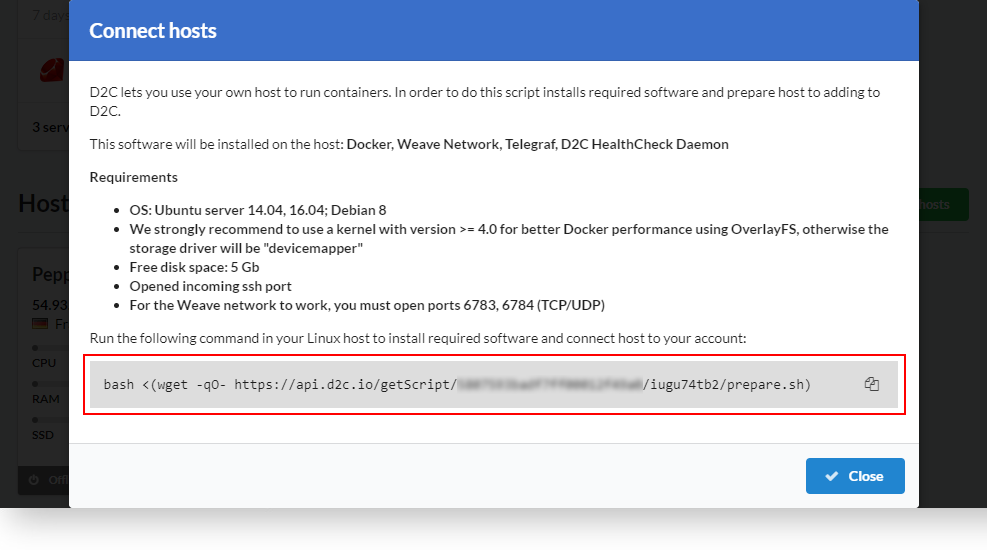
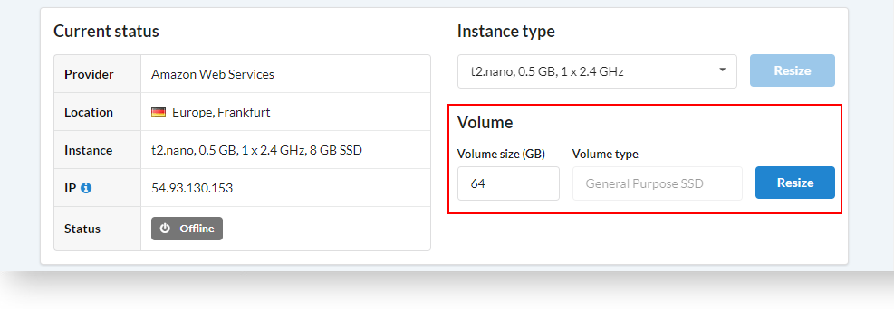
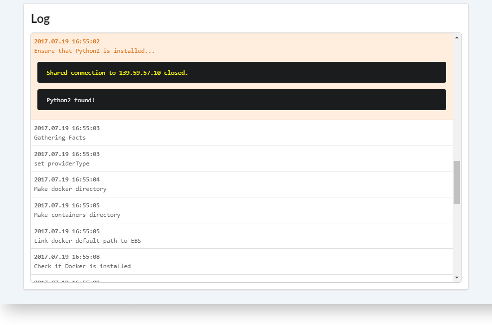
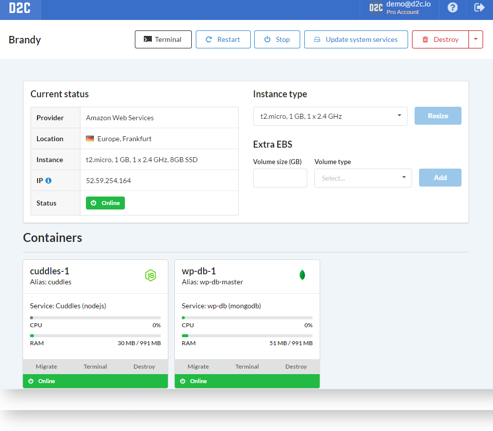
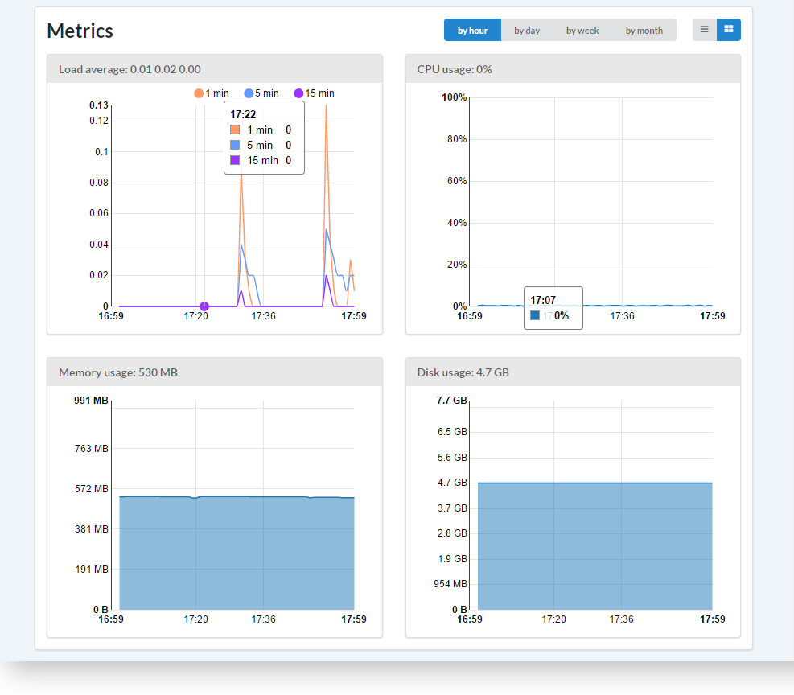
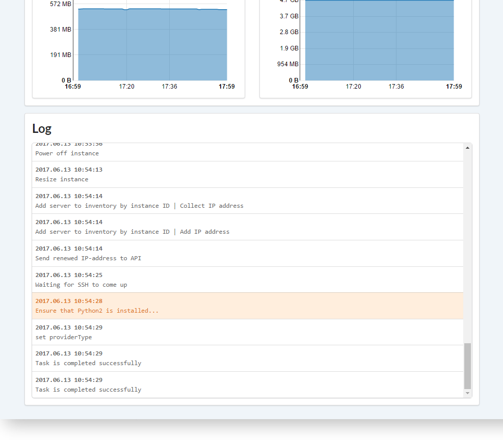

# Вступление

Сервисы не могут запускаться в Интернете без сервера. D2C может автоматически предоставлять их для вас. Просто предоставьте токен к облачному провайдеру, который будете использовать и D2C будет создавать, удалять, изменять конфигурацию (масштабировать) сервера по вашему требованию. Облачный провайдер будет списывать средства с вашего аккаунта в зависимости от потраченных ресурсов и используемого тарифа. D2C не предоставляет свои облачные ресурсы, а только автоматизирует процесс управления ресурсами облачных провайдеров.

Кроме того, вы можете разворачивать сервисы на собственных серверах или у облачных провайдеров, которые ещё не поддерживаются в D2C. Мы предоставляем скрипт, который проверяет совместимость сервера и добавляет его в вашу панель управления D2C.

Любой из серверов может использоваться для любого [проекта](/getting-started/projects/).

## Поддерживаемые операционные системы и требования

Когда вы создаете сервер мы устанавливаем на него **Ubuntu 16.04**.

Когда вы **подключаете** свой сервер он должен соответствовать следующим требованиям:

- Ubuntu 14.04/16.04 или Debian 8/9
- Версия ядра >= 4.2. Мы не рекомендуем версии 4.12 и 4.13 имеющих замедление производительности VXLAN туннелинга в 60 раз
- Свободное место на диске: 5 Gb
- Открытый SSH порт
- Для работы с сетью Weave, требуется открыть порты 6783, 6784 (TCP/UDP)
- hostname должно быть уникально и не может называться "localhost"
- Для наилучшей производительности рекомендуется убедиться, что туннелинг пакетов с пощощью VXLAN разрешен

!!! note

    D2C не поддерживает сервера с установленным Docker, в целях избегания конфликтов конфигураций.

## Как подключить свой сервер

1. Войдите в ваш [D2C аккаунт](https://panel.d2c.io/account/signup)
2. Нажмите **Подключить свой сервер**
3. Скопируйте команду

4. Подключитесь к вашему серверу через **SSH**
5. Вставьте и запустите команду, которую скопировали до этого

## Поддерживаемые хостинг провайдеры

- Amazon Web Services ([инструкция по подключению AWS](/getting-started/cloud-providers/#amazon-web-services))
- DigitalOcean ([инструкция по подключению DigitalOcean](/getting-started/cloud-providers/#digital-ocean))
- Vultr ([инструкция по подключению Vultr](/getting-started/cloud-providers/#vultr))
- UpCloud ([инструкция по подключению UpCloud](/getting-started/cloud-providers/#upcloud))

Скоро будут доступны:

- Google Cloud Platform

## ПО, которое устанавливается на сервер

- Docker
- Weave Network
- Telegraf
- D2C HealthCheck Daemon

## Действия

- Терминал
- Перезапустить
- Остановить/Запустить
- Обновить системные сервисы (Docker, Weave, Telegraf, Lsync). Обновлять можно все сразу или по-отдельности
- Удалить (+удалить с форсом)
- [Изменить размер сервера](/platform/scaling/#_3) (только для облачных серверов)
- Изменить размер диска (для серверов AWS)

## AWS EBS

Амазон EC2 предоставляет дополнительно место  на диске которое называется [Amazon Elastic Block Storage](https://aws.amazon.com/ebs/?nc1=h_ls) (EBS). Вы можете изменять размер EBS без остановки серверов.

## Демонстрационные сервера

Вы можете создать демонстрационный сервер для тестирования платформы.
Конфигурация сервера: t2.micro (1 GB, 1 x 2.4 GHz, 4GB SSD).
Регион: N. Virginia, The United States

Демонстрационный сервер создается на один час и будет удален после истечения этого времени со всеми сервисами и контейнерами. После этого вы сможете добавить новый на такой же срок.

## Логи

У каждого сервера есть логи (серверные логи).

Строчки, которые заканчиваются троеточием содержат дополнительную информацию, которую можно открыть с помощью клика мышки.

## Подключение через SSH и SFTP

[Отдельная статья по подключению через SSH и SFTP](/platform/ssh-sftp/).

!!! note

    Один публичный ключ должен использоваться только один раз вне зависимости от его типа (SSH or SFTP). Если вам требуется изменить метод подключения, необходимо создать дополнительный публичный ключ или заменить добавленный.

## Данные сервисов

Все данные сервисов находятся в директории:
`/ebs/containers/serviceName`

Например, исходники вы можете найти в:
`/ebs/containers/serviceName/sources`

Бэкапы:
`/ebs/containers/serviceName/backup`

### Как выглядит страница сервера

