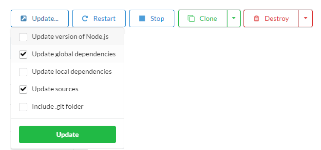
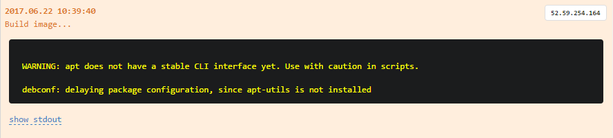
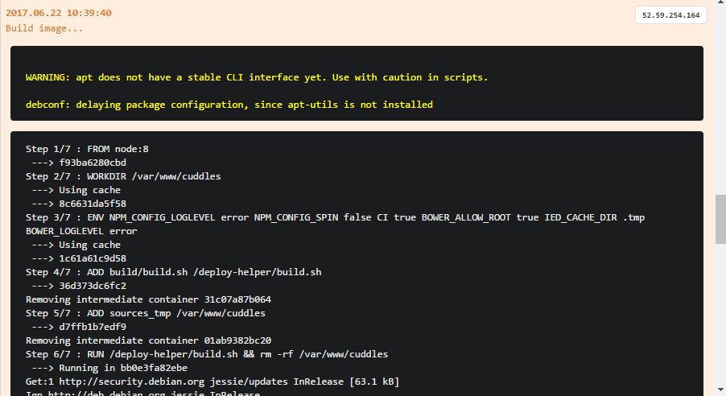
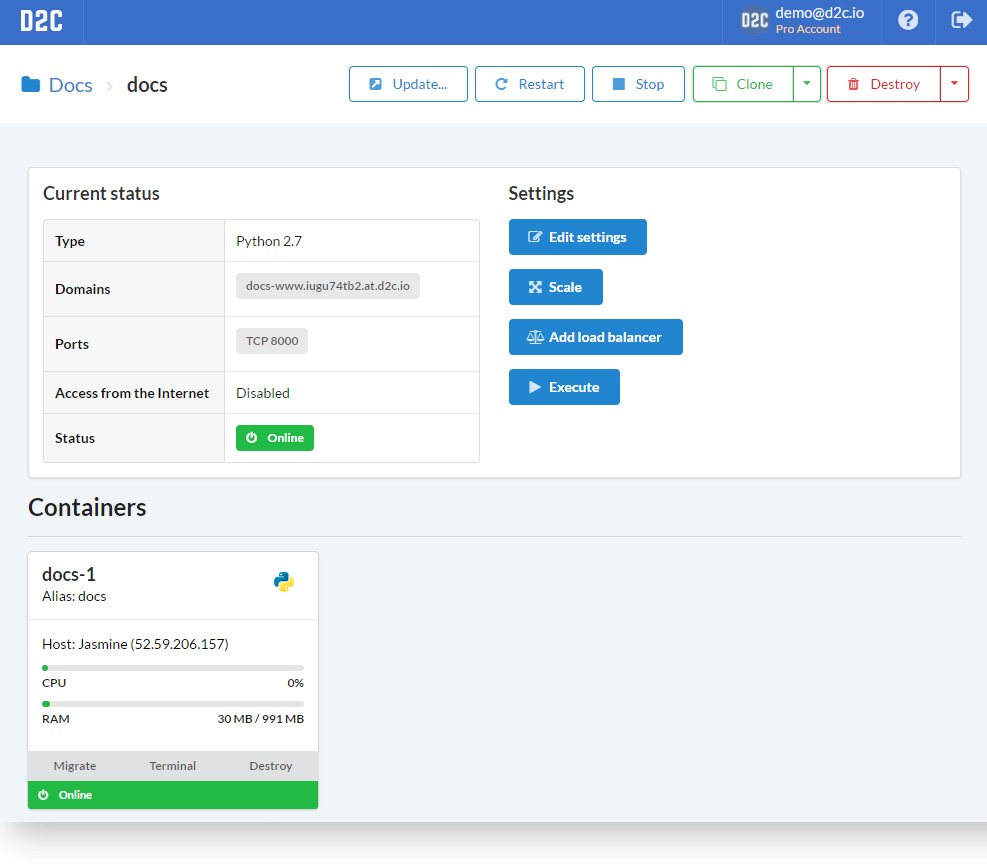
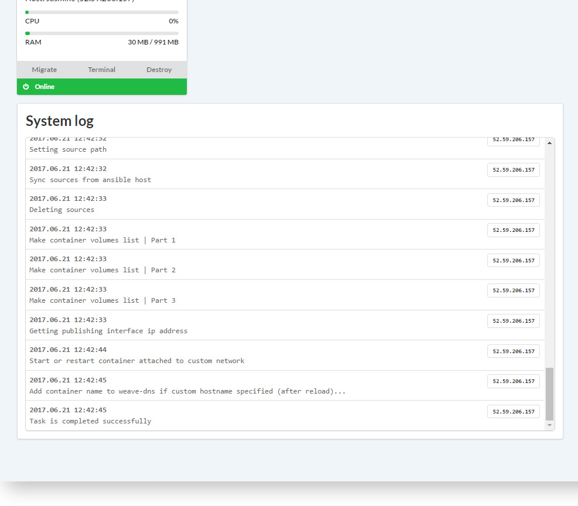

# Вступление

Сервис это приложение, развернутое с помощью D2C.

D2C запускает ваши сервисы/приложения внутри контейнеров. Мы используем Docker в качестве платформы контейнеризации. Каждый сервис это отдельный контейнер: веб-приложение, база данных, балансировщик нагрузки и т.д. Docker устанавливается и настраивается на сервера, которые добавляются в D2C автоматически. Когда вы разворачиваете сервис все необходимые файлы отправляются на сервер и образ контейнера собирается локально на сервере и затем запускается с помощью демона Docker. D2C настраивает окружение автоматически, поэтому мы не рекомендуем добавлять уже настроенные сервера в целях избежения конфигурационных конфликтов.

Единовременно вы можете развернуть до 50 контейнеров (за исключением сервисов, у которых есть свои ограничения).

## Именование

У каждого сервиса есть своё **уникальное** имя. Сервисы могут обращаться друг к другу по имени контейнера (например `servicename-1`) или по alias-именам (например `servicename` или `servicename-master`). Не важно на каком сервере сервис запущен – все взаимосвязи внутри [приватной сети](/platform/private-network/) прозрачны для сервисов. Более того, мы используем имена для создания публичных доменов, таких как: **[servicename]-[www].[accountID].[at].d2c.io** для ваших сервисов, которые обслуживает NGINX или HAProxy.

Имя должно начинаться с буквы и содержать не более 16 символов (допускаются латинские символы и цифры).

## Нативно поддерживаемые сервисы

### Сервисы хранения данных

Название          | Конфигурация               | Масштабируемый | Поддерживаемые версии
:---------------- | :------------------------- | :------------- | ---------------------------
**MongoDB**       | StandAlone или ReplicaSet  | Да             | 3.0, 3.2, 3.4, 3.6, 4.0
**MySQL**         | StandAlone или MasterSlave | Да             | 5.5, 5.6, 5.7, 8.0
**MariaDB**       | StandAlone или MasterSlave | Да             | 5.5, 10.0, 10.1, 10.2, 10.3
**Percona**       | StandAlone или MasterSlave | Да             | 5.5, 5.6, 5.7
**PostgreSQL**    | StandAlone или MasterSlave | Да             | 9.6, 10.0, 10.1, 10.2, 10.3, 10,4, 10.5
**Crate**         | StandAlone                 | Нет            | 2.0, 2.1, 2.2, 2.3
**Redis**         |                            | Да             | 2.8, 3.0, 3.2, 4.0
**Memcached**     |                            | Да             | 1.4, 1.5
**ElasticSearch** | StandAlone                 | Нет            | 2.4, 5.3, 5.5, 5.6

### Сервисы приложений

Название       | Масштабируемый | Поддерживаемые версии
:------------- | :------------- | :--------------------------------
**Node.js**    | Да             | 4, 6, 8, latest(9)
**Python**     | Да             | 2.7, 3.5, 3.6, 3.7
**Go**         | Да             | 1.7, 1.8, 1.9, 1.10, 1.11
**Ruby**       | Да             | 1.9, 2.0, 2.1, 2.2, 2.3, 2.4, 2.5
**PHP-FPM**    | Да             | 5.6, 7.0, 7.1, 7.2
**APACHE+PHP** | Да             | 5.6, 7.0, 7.1, 7.2

### Другие сервисы

Название                                     | Масштабируемый | Поддерживаемые версии  | Комментарий
:------------------------------------------- | :------------- | :--------------------- | :-----------------------------------------------------------------------------------------------------------------------------------------------------
**NGINX**                                    | Нет            | 1.11, 1.12, 1.13, 1.14, 1.15 | NGINX это edge сервис (веб-сервер), может обслуживать несколько сервисов, в том числе из разных проектов. Может генерировать бесплатные [TSL сертификаты](/platform/domains-and-certificates/) (by Let's Encrypt).
**NGINX-Cluster**                            | Да             | 1.11, 1.12, 1.13, 1.14, 1.15 | NGINX-Cluster используется для случаев, когда требуется обслуживать более одного PHP-FPM контейнера. [Пример](https://263301.selcdn.ru/d2c-content/2017/10/2017-10-25_03h56_09.png).
**NGINX-Static**                             | Да             | 1.11, 1.12, 1.13, 1.14, 1.15 | NGINX-Static Возвращает статические файлы (HTML, JS, CSS, images, etc.). It cannot serve other services.
**HAProxy**                                  | Нет            | latest                       | HAProxy - [балансировщик](/platform/balancing/). Может выступать в роли edge сервиса и генерировать [TSL сертификаты](/platform/domains-and-certificates/)
**Docker** (Сервисы основанные на Docker образах) | Да

## Действия

Действия со всеми сервисами:

- Обновить
- Перезапустить
- Остановить/Запустить
- Переместить (между проектами)
- [Клонировать](/platform/cloning-apps/)
- Удалить (+удалить с форсом)
- Удалить и развернуть. Для случаев, когда необходимо развернуть сервис с нуля
- Редактировать настройки
- [Масштабировать](/platform/scaling/) (кроме некоторых сервисов, например NGINX)
- Добавить [балансировщика](/platform/balancing/)
- Выполнить - выполнение команду внутри запущенного контейнера сервиса

Для баз данных MongoDB, MySQL, MariaDB, Percona, PostgreSQL

- Сменить пароль пользователя superuser

У всех [**сервисов приложений**](/getting-started/services/#_5) есть возможность гибкого обновления:

- Обновить версию (у сервисов хранения данных и других сервисов есть только эта функция)
- Обновить глобальные зависимости
- Обновить локальные зависимости
- Обновить исходники
- Включить папку .git

## Данные сервисов

Все данные сервисов находятся в директории: `/ebs/containers/serviceName`

Например, исходники вы можете найти в: `/ebs/containers/serviceName/sources`

Бэкапы: `/ebs/containers/serviceName/backup`

## Системные логи

У каждого сервиса есть системные логи (логи деплоя).

Строчки, которые заканчиваются троеточием содержат дополнительную информацию, которую можно открыть с помощью клика мышки.

Сообщения создания образом содержат stdout, которые тоже можно развернуть.

### Как выглядит страница сервиса

