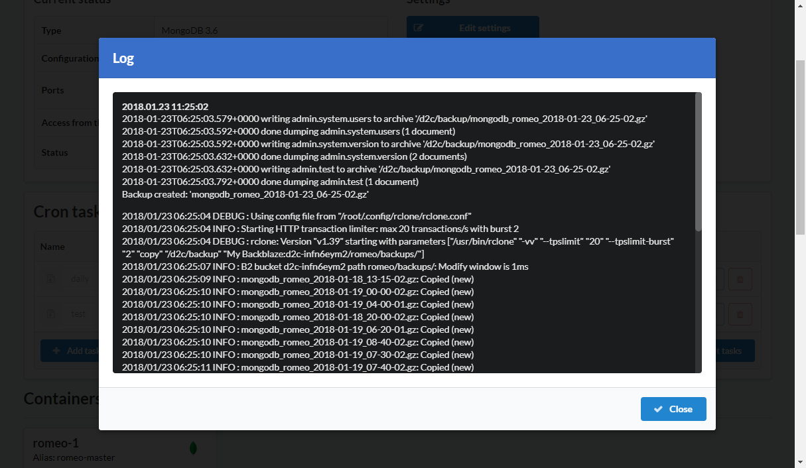

# Introduction

Бэкап (резервное копирование) это процесс создания и архивирования копии данных, предназначенных для восстановления. Создать и управлять бэкапами можно на странице сервисов.

## Поддерживаемые сервисы

1. MySQL
2. Percona
3. MariaDB
4. PostgreSQL
5. MongoDB

## Бэкап провайдеры

1. Amazon S3
2. Backblaze
3. Dropbox
4. Digital Ocean Spaces
5. Microsoft OneDrive
6. Hubic
7. FTP
8. SFTP

## Как создать бэкап

1. Откройте страницу сервиса
2. Нажмите **+Добавить бэкап** в блоке Cron задач
3. Укажите имя задачи
4. Выберите контейнер
5. Укажите время, используя время сервера (в большинстве случаев используется UTC)
6. Выберите бэкап провайдера ([Как добавить бэкап провайдера](/getting-started/storage-providers/))
7. Click **Save**

## Как восстановить данные из бэкапа

!!! note

    Мы не гарантируем корректное восстановление из бэкапов, созданных с использованием сторонних сервисов

1. Откройте страницу сервиса
2. Нажмите **Восстановить**
3. Выберите бэкап провайдера
4. Убедитесь, что путь к файлу корректный. Отредактируйте при необходимости
5. Вставьте имя файла из которого требуется восстановить данные
6. Нажмите **Восстановить данные**

## Логи

Каждая бэкап задача логгируется. Для просмотра логов - нажмите на иконку **Лог**.

## Удаление старых бэкапов с севера

Самый простой способ - добавить следующую [крон задачу](/platform/cron/): 

`ls -td /d2c/backup/* | tail -n +2 | xargs rm -- && echo "OK" || echo "FAIL"`

Будут удаляться все бэкапы, кроме последнего.

### Скриншоты

