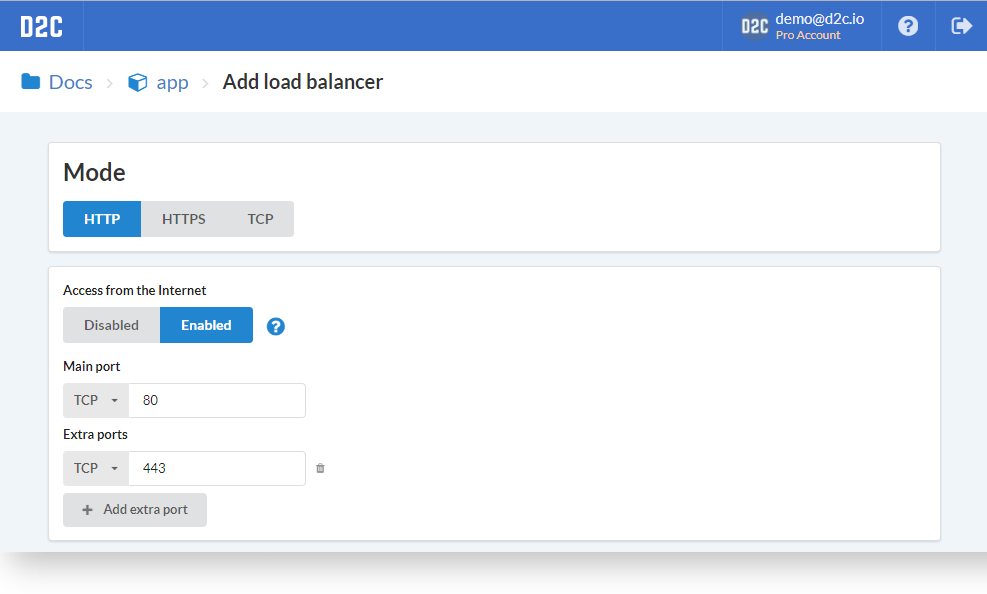
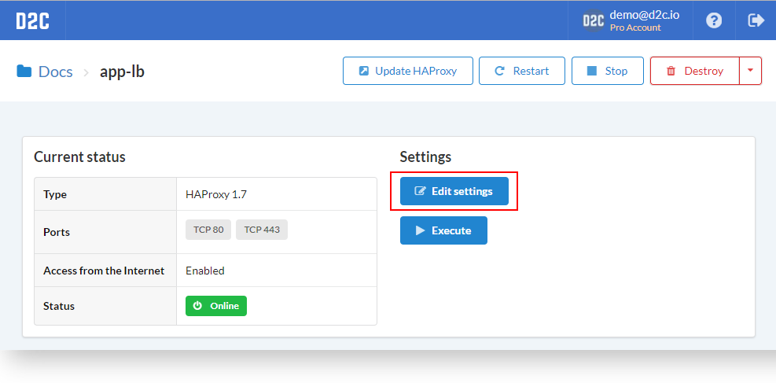
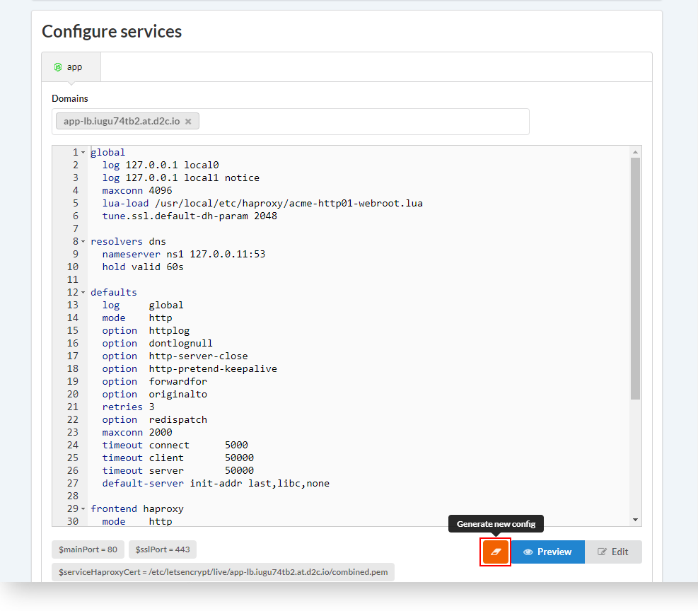

# Вступление

D2C использует в качестве балансировщика [HAProxy](http://www.haproxy.org/). Он поддерживает разные протоколы: **HTTP**, **HTTPS**, **TCP**. Конфиг генерируется автоматически, в дальнейшем его можно изменять.

## Как развернуть балансировщика нагрузки

1. Разверните или откройте страницу сервиса, который нужно балансировать
2. Нажмите **Добавить балансировщика**
3. Выберите режим и сервер
4. Нажмите **Добавить балансировщика**

Если вы выберите HTTPS, то по умолчанию будет создан конфиг с бесплатными сертификатами от [Let's Encrypt](https://letsencrypt.org/). После разворачивания вы сможете  добавить свой сертификат. По необходимости можно указать любые дополнительные порты. Вы также можете выключит доступ из Интернета, который включен по умолчанию для HAProxy.

## Редактирование

Вы можете изменить настройки балансировщика после разворачивания. Для этого, откройте сервис HAProxy и нажмите **Редактировать**.

Для того, чтобы изменить режим или добавить свой HTTPS сертификат найдите блок **Обслуживаемые сервисы**  и нажмите на иконку **Сгенерировать новый конфиг**.

Выберите режим и нажмите **Сгенерировать новый конфиг**.

Если вам требуется HTTPS, вы можете добавить свой сертификат или использовать бесплатные автообновляемые сертификаты от Let's Encrypt.

Нажмите **Обновить сервис**.

