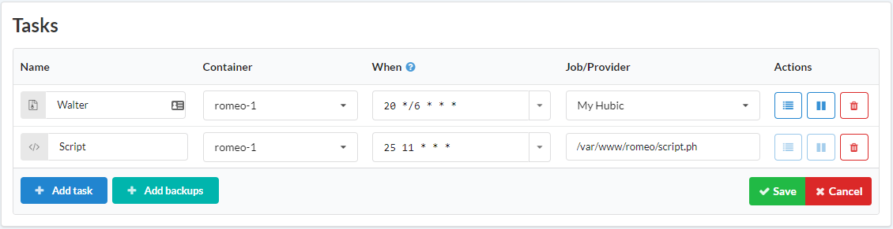
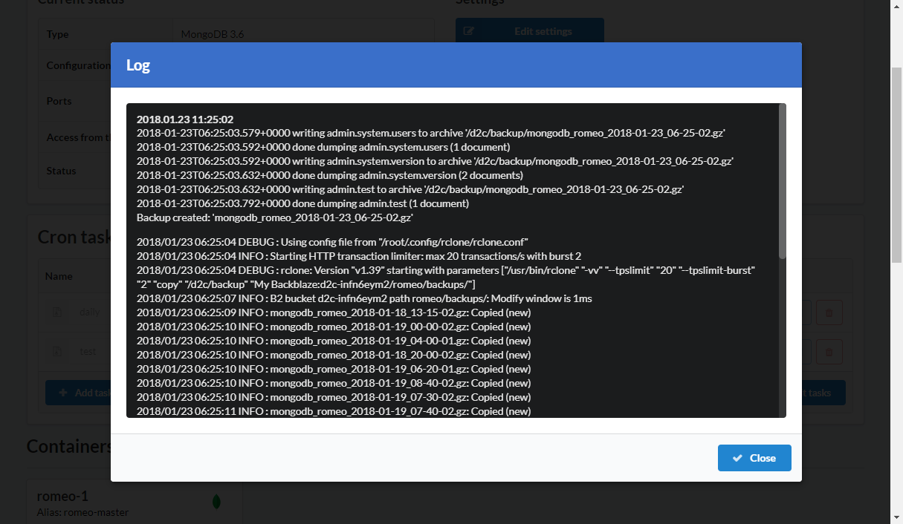

# Вступление

Крон — это демон для периодического выполнения задач в определенное время. Вы можете создавать и управлять ими в блоке Cron задачи на странице сервиса.

## Как создать cron задачу

1. Откройте страницу сервиса
2. Кликните **+Добавить задачу** в блоке Cron задачи
3. Введите имя для новой задачи
4. Выберите контейнер
5. Укажите время выполнения используя время сервера (чаще всего используется UTC)
6. Введите задачу
7. Нажмите **Сохранить**

## Cron выражения

### Стандартные

```
┌───────────── минута (0 - 59)
│ ┌───────────── час (0 - 23)
│ │ ┌───────────── день месяца (1 - 31)
│ │ │ ┌───────────── месяц (1 - 12)
│ │ │ │ ┌───────────── день недели (0 - 6) (Воскресенье-Суббота)
│ │ │ │ │                                     
│ │ │ │ │
│ │ │ │ │
* * * * *  команда для выполнения
```

### Нестандартные

| Запись                  | Описание                                                                       | Эквивалентно  |
| :-------------          | :-------------                                                                 | :------------- |
| @yearly (или @annually) | Выполняется один раз в год, 1 января, в полночь                                | 0 0 1 1 * |
| @monthly                | Выполняется один раз в месяц, в первый день месяца, в полночь                  | 0 0 1 * * |
| @weekly                 | Выполняется один раз в неделю, Run once a week at midnight on Sunday morning   | 0 0 * * 0 |
| @daily                  | Выполняется один раз в день, в полночь                                         | 0 0 * * * |
| @hourly                 | Выполняется один раз в час, в начале часа                                      | 0 * * * * |
| @reboot                 | Выполняется при запуске                                                        | N/A |

### Пример

| Имя           | Контейнер      | Когда           | Задача/провайдера    |
| :------------- | :------------- |:-------------  | :-------------  |
| Mytask         | apollo-1       | 25 11 * * *    | /var/www/apollo/script.sh  |

Эта задача будет выполнять скрипт script.ph сервиса apollo каждый день в 11:25

## Лог

Каждая Cron задача логгируется и вы можете просмотреть их нажав на иконку **Лог**.




