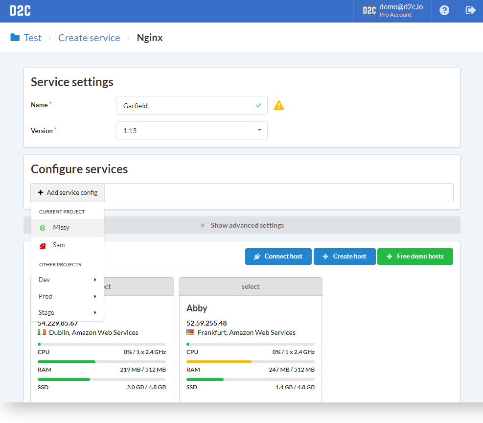
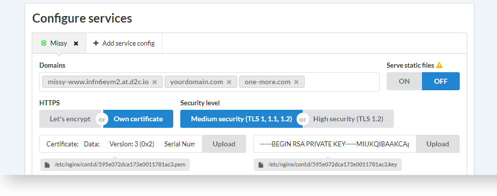
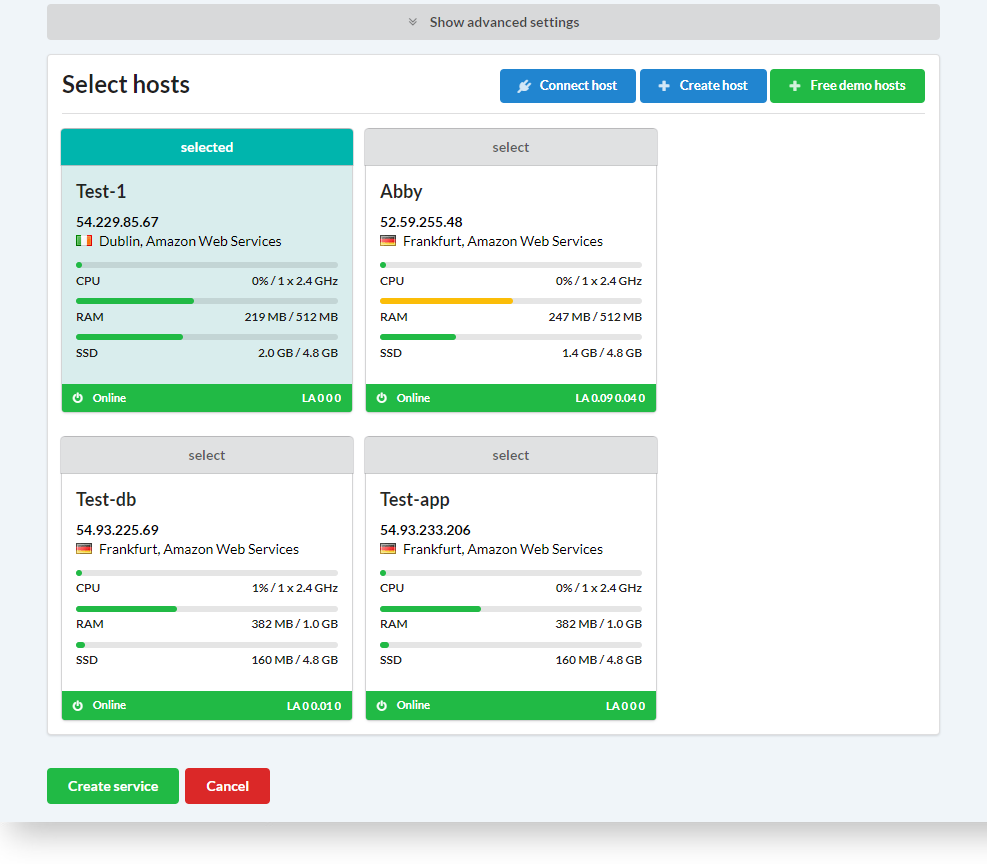

# Вступление

**Домены** и **сертификаты** в D2C выдаются, когда NGINX или HAProxy обслуживают любой из [Сервисов приложений](/getting-started/services/#_5). По умолчанию приложение получает домен вида: _**имя_сервиса-www.accountID.at.d2c.io**_ (_**имя_сервиса-lb-www.accountID.at.d2c.io**_). Вы также можете добавлять дополнительные домены и TLS сертификаты.

Для того, чтобы добавить домен или TLS сертификат (или добавить бесплатный сертификат от [Let's Encrypt]()) у вас должно быть:

- Сервер со свободными портами 80 и 443
- NGINX или HAProxy с включенным [доступом из Интернета](/getting-started/creating-services/#_10)

!!! note

    Убедитесь, что DNS-запись для дополнительного домена совпадает с IP-адресом сервера NGINX или HAProxy

## Как добавлять домены и сертификаты

### Видео-инструкция

<iframe width="640" height="360" src="https://www.youtube.com/embed/kED5l7f1Ub0" frameborder="0" allow="autoplay; encrypted-media" allowfullscreen></iframe>
 

Процесс для обоих сервисов практически одинаковый. Различие только в том, что используя NGINX вы можете добавлять домены и сертификаты во время создания или редактирования сервиса, а в случае с HAProxy - только во время редактирования.

Рассмотрим пример с NGINX. Редактирование сервиса HAProxy описано [здесь](/platform/balancing/#_3). Блок **Обслуживаемые сервисы** одинаков для обоих сервисов

### Быстрый старт с HTTP протоколом

1. Начните создавать NGINX или нажмите **Редактировать**, если сервис уже создан
2. Нажмите **Добавить конфиг сервиса**
3. Выберите сервис, который будет обслуживать NGINX
4. Выберите HTTP протокол и нажмите **Сгенерировать конфиг**
5. Укажите домены и поддомены в специальном поле
6. Выберите сервер и нажмите **Создать сервис** или **Обновить**, если вы редактируете сервис

### Использование бесплатных TLS от Let's Encrypt

!!! note

    DNS-запись для дополнительных доменов с таким же адресом, как и у сервера NGINX или HAProxy должна быть доступна в момент создания или редактирования сервиса

1. Начните создавать NGINX или нажмите **Редактировать**, если сервис уже создан
2. Нажмите **Добавить конфиг сервиса** в блоке **Обслуживаемые сервисы**
3. Выберите сервис, который будет обслуживать NGINX
4. Выберите HTTPS протокол и нажмите **Сгенерировать конфиг***
5. Укажите домены и поддомены в специальном поле
6. Выберите **Let's Encrypt**
7. Выберите сервер и нажмите **Создать сервис** или **Обновить**, если вы редактируете сервис

### Использование своего TLS сертификата

1. Начните создавать NGINX или нажмите **Редактировать**, если сервис уже создан
2. Нажмите **Добавить конфиг сервиса** в блоке **Обслуживаемые сервисы**
3. Выберите сервис, который будет обслуживать NGINX
4. Выберите HTTPS протокол и нажмите **Сгенерировать конфиг***
5. Укажите домены и поддомены в специальном поле
6. Выберите **Свой сертификат**
7. Выберите уровень защиты и загрузите свой HTTPS сертификат и ключ
8. Выберите сервер и нажмите **Создать сервис** или **Обновить**, если вы редактируете сервис

### Скриншоты

