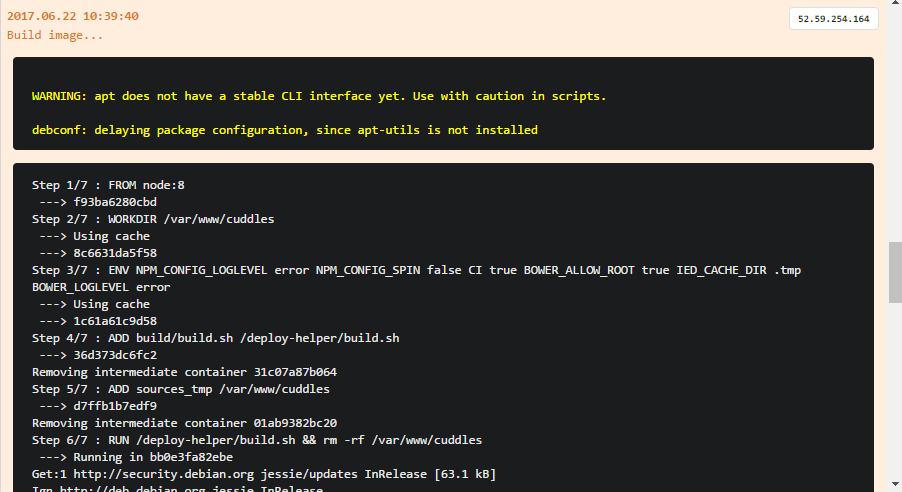
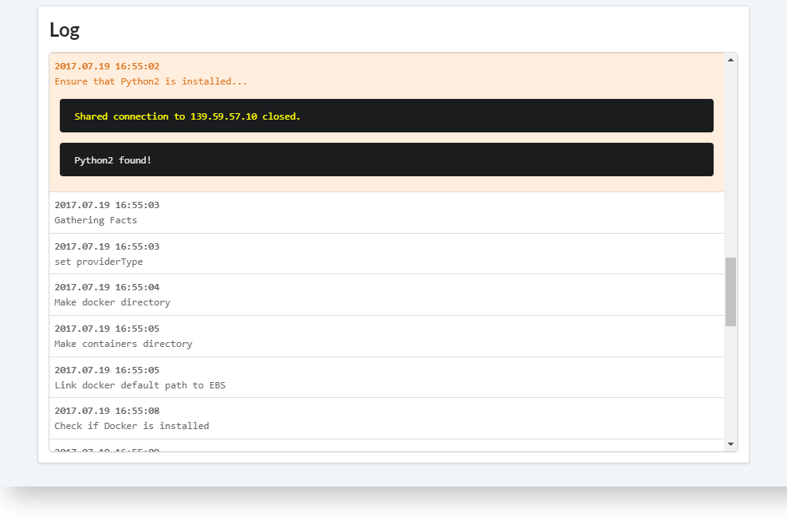

# Вступление

D2C собирает все stdout и stderr сервисов и показывает их в реальном времени. Вы можете просматривать логи в вашей панели управления. Учитывайте, что ваш сервис должен записывать логи в стандартный output для Docker домена, чтобы была возможность их перехватить и отправить в нашу лог категорию.

В D2C есть три типа логов:

- **Системные логи** - включает все сообщения о разворачивании сервисов
- **Логи контейнеров** - включает все логи контейнеров
- **Логи серверов** - включает все сообщения о действиях с серверами

Ниже приведена сравнительная таблица распределения хранилища для логов в системе на текущих и будущих тарифах:

Тип логов | Free and Early Bird (Pro) | Personal | Team (coming soon)
--|---|---|--
Системные логи | 100MB | 200MB | 200MB
Логи серверов | 100MB | 200MB | 200MB
Логи контенейров | 100MB | 600MB | 2600MB

## Системные логи

У каждого сервиса есть системные логи (логи разворачивания)

Строки, в конце которых есть троеточие, содержат дополнительную информацию и могут быть развернуты по клику мышки.

Сообщения могут содержать stdout, который также может быть показан по клику мышки.

## Логи контейнеров

<!--нужно больше инфы (спросить у Паши)-->

У каждого контейнера есть свои логи. Вы можете следить за ними в панели управления. [Ознакомьтесь](https://docs.docker.com/engine/admin/logging/view_container_logs/) с более подробной информацией о Docker логах.

## Логи серверов

Логи сервера содержат логи создания и настроек.

Строки, в конце которых есть троеточие, содержат дополнительную информацию и могут быть развернуты по клику мышки.

