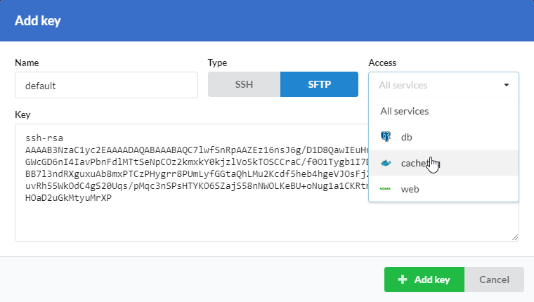
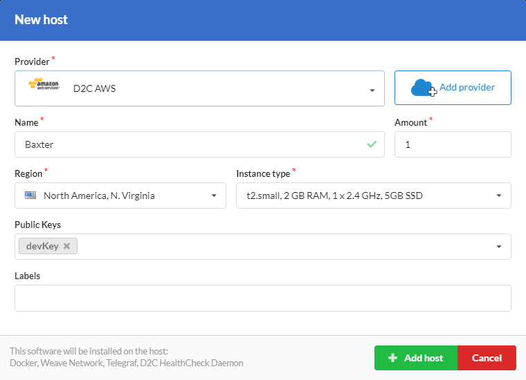

# Вступление

В некоторых случаях требуется доступ по SSH или SFTP к подключенным серверам. Для этих целей вы можете использовать функцию управления ключами.

!!! note

    Один публичный ключ должен использоваться только один раз. Если вам требуется изменить метод подключения, необходимо создать дополнительный публичный ключ или заменить добавленный.

## Создание SSH ключей

Для того, чтобы подключиться к серверу вам нужно добавить свой публичный SSH ключ. Если у вас ещё нет SSH ключей и вы используете Linux или MacOS, [следуйте этой инструкции](https://confluence.atlassian.com/bitbucketserver/creating-ssh-keys-776639788.html) для создании ключей. Если вы используете Windows и Putty для подключения, [следуйте этой инструкции](https://www.digitalocean.com/docs/droplets/how-to/add-ssh-keys/create-with-putty/).

## Добавление ключей для подключения через SSH

- Откройте [страницу настроек](https://panel.d2c.io/settings)
- Найдите блок Публичные ключи и нажмите **Добавить ключ**
- Задайте имя ключа
- Выберите SSH и будет ли он стандартным. _Стандартный ключ добавляется в список ключей при создании нового сервера_
- Вставьте ваш публичный SSH ключ в поле ключ
- Нажмите **Добавить ключ**

После этого, вы можете добавлять ваши ключи на новые или существующие сервера.

## Добавление ключей для подключения через SFTP

- Откройте [страницу настроек](https://panel.d2c.io/settings)
- Найдите блок Публичные ключи и нажмите **Добавить ключ**
- Задайте имя ключа
- Выберите SFTP. Вы можете предоставить доступ ко всем сервисам или к конкретному
- Вставьте ваш публичный SSH ключ в поле ключ
- Нажмите **Добавить ключ**

## Подключение к серверу

Пользователь для подключения к серверу - `deploy`.

Для подключения через SSH выполните следующую команду в терминале:

```
ssh deploy@hostIP
```

Для подключения через SFTP выберите способ подключения через SSH и загрузите ваш приватный ключ.

### Скриншоты



