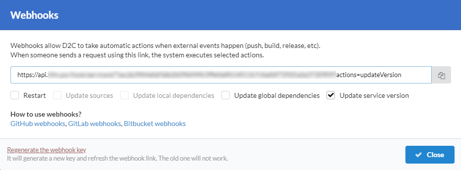

# Вступление

Webhooks позволяют D2C выполнять автоматические действия, когда происходят внешнее событие (push, build, release, и т.д.). В случае отправки запроса с использованием ссылки система выполняет выделенные действия. Эта функция доступна только для [Pro аккаунтов](/account/plan).

Больше информации о Webhooks и о том как их использовать в [GitHub](https://developer.github.com/webhooks/creating/), [Gitlab](https://docs.gitlab.com/ee/user/project/integrations/webhooks.html#overview) и [BitBucket](https://confluence.atlassian.com/bitbucket/manage-webhooks-735643732.html#Managewebhooks-create_webhookCreatingwebhooks) документациях.

## Действия

Действие                   | Что произойдет?
-------------------------- | ----------------------------------------------------------------------------------------------------------------------------------
Restart                    | Рестарт сервиса
Update sources             | Быстрое обновление исходников, без удаления старых файлов и без обновления локальных зависимостей
Update local dependencies  | Обновление исходников с обновлением локальных зависимостей и подготовка кода к работе (примеры: `gulp build`, `npm install`, `composer install`)
Update global dependencies | Обновление глобальных зависимостей (примеры: `apt-get install`, `pip install` )
Update service version     | Обновление глобальных зависимостей и версии Docker образа сервиса до последней минорной версии в рамках выбранной мажорной версии

## Ключ

Webhook ключ содержит и генерируется автоматически. Вы можете сгенерировать новый, но старый после этого работать не будет.

### Скриншоты

